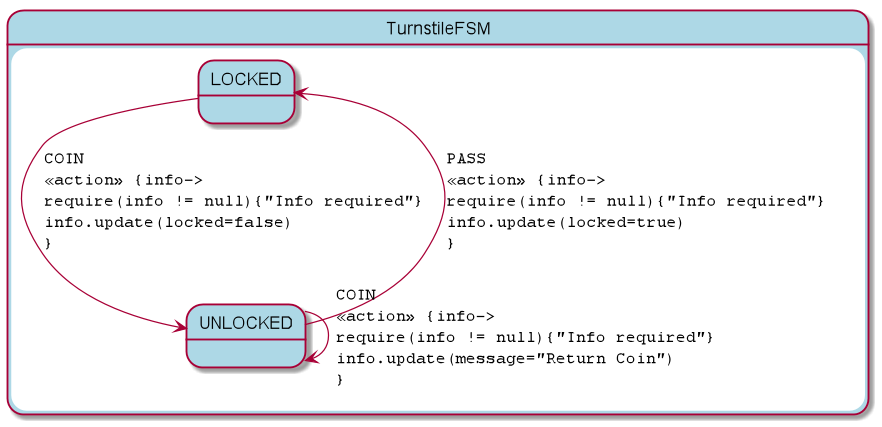

= KFSM Turnstile Sample for JavaScript in Browser

A simple application to demonstrate implementing [KFSM](https://github.com/open-jumpco/kfsm) with the classic Turnstile FSM.

This implementation uses Kotlin code to manipulate the register event handlers on the buttons and manipulate the DOM to update the
 display state of the elements.

[source,bash]
----
./gradlew build
----

All the files needed to run will be in `build/dist`

Or you can launch it using

[source,bash]
----
./gradlew browserRun
----

== Generated State Table

=== TurnstileFSM State Map

|===
| Start | Event[Guard] | Target | Action

| LOCKED
| COIN
| UNLOCKED
|  `{info->require(info != null){"Info required"}info.update(locked=false)}`

| UNLOCKED
| PASS
| LOCKED
|  `{info->require(info != null){"Info required"}info.update(locked=true)}`

| UNLOCKED
| COIN
| UNLOCKED
|  `{info->require(info != null){"Info required"}info.update(message="Return Coin")}`
|===

== Generated State Diagram

To learn more about visualization visit link:https://github.com/open-jumpco/kfsm-viz[kfsm-viz] and
link:https://github.com/open-jumpco/kfsm-viz-plugin[kfsm-viz-plugin]
